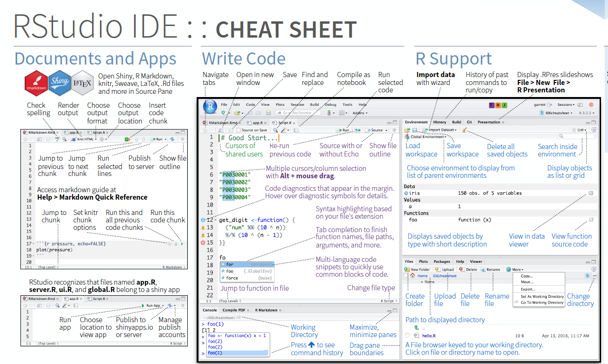
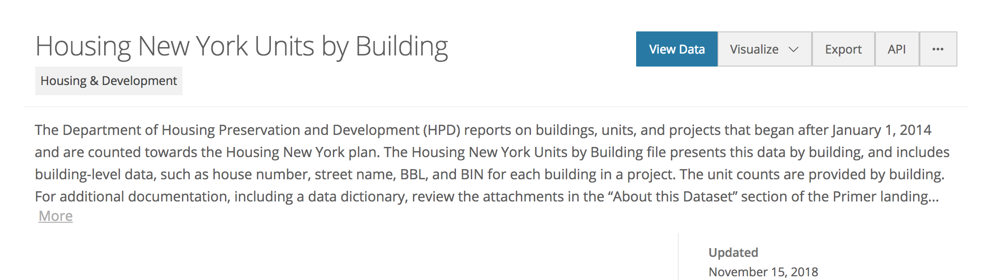

```{r setup, include=FALSE}
knitr::opts_chunk$set(echo = TRUE)

#rm(list = ls())
```

## This document

This is document to help start using R in best possible way, using some basic visualisation tasks to demonstrate workflow, logic and nice output. I hope you'll learn how to use R so that you'll 
1. write organised and portable code which is also readable
2. help to document, share and learn more!

Resources: 

* Huge praise goes to slideset from [William Chase](https://www.williamrchase.com/slides/intro_r_anthropology_2018) about best practices.
* Also [Hadley Wickhams]{http://hadley.nz} packages are always so helpful!
* Newest shiny think I found was [Esquisse](https://github.com/dreamRs/esquisse)
* How to write [Markdown](https://github.com/adam-p/markdown-here/wiki/Markdown-Cheatsheet) like this

## R and RStudio

R is the language used to code in the R environment. R-Studio is a free and open-source integrated development environment for R, like visual interface, with some special add-ins.

Read more: [What is R?](https://www.r-project.org/about.html) and [What is RStudio](https://www.rstudio.com/products/rstudio/)


## Functionalities in RStudio


Please dowload and read through these eccellent cheat sheets! Eg. [RStudio IDE](https://github.com/rstudio/cheatsheets/raw/master/rstudio-ide.pdf) where the above pic is taken from and [ggplot2](https://github.com/rstudio/cheatsheets/raw/master/data-visualization-2.1.pdf)

## Basic R 

Again go and dowload cheat sheet for [Base R](http://github.com/rstudio/cheatsheets/raw/master/base-r.pdf)

R has all kind of different formats of objects such as:
- variables 
- vectors
- lists
- data frames
- matrixes

Usually when something is not working as expected it it because of wrong object type. You can check the type by ```class()```. 

```{r}
##assigning variable
a <- "star"

##assigning vector
vector_a <- c(2, 4, 6)

##assigning list
list_a <- list(x = 1:5, y = c('a', 'b'))
class(list_a)

##assigning dataframe
df_a <- data.frame(x = 1:3, y = c('a', 'b', 'c'))
class(df_a)
```


## Packages

"R packages are collections of functions and data sets developed by the community. They _increase the power of R_ by improving existing base R functionalities, or by adding new ones. For example, if you are usually working with data frames, probably you will have heard about dplyr or data.table, two of the most popular R packages." [Source](https://www.datacamp.com/community/tutorials/r-packages-guide)

Packages can be downloaded either with command ```install.packages("packagename")``` or in RStudio using right hand side "Packages" -tab and searchin for the desired package. 

If you will make a more intensive use of the package, then load it into memory. The simplest way to do this is with the ```library(packagename)``` command.

## Reading data
Dowload the dataset from [kaggle competition](https://www.kaggle.com/becksddf/churn-in-telecoms-dataset) and upload it to the RStudio selection "Import Dataset" or using the following command. 

```{r data, warning=FALSE}
##loading already installed packages into memory
library(readr) ##reading documents

telco_data <- read_csv("~/Downloads/bigml_59c28831336c6604c800002a.csv")

##see summary of data 
summary(telco_data)

```


One could also use data from datasets() #https://stat.ethz.ch/R-manual/R-devel/library/datasets/html/00Index.html

```{r titanic}
datasets::Titanic
```


Or directly from open sources with R package wrappers
```{r}
# List all available indicators from THL Sotkanet
library(sotkanet) 
sotkanet.indicators <- SotkanetIndicators(type = "table")
```
More about getting data with different methods https://www.datacamp.com/community/tutorials/r-data-import-tutorial

## Datamanipulation

```{r manipulation, message=FALSE, warning=FALSE}
library(dplyr) ## piping and other handy functions

telco_data%>%group_by(state)%>%summarise(avg_minute=mean(`total day minutes`))

library(lubridate) ##for dates
library(tidyr) ## transposing and extracting

group <- telco_data%>%group_by(state, `area code`)%>%summarise(avg_minute=mean(`total day minutes`))

group%>%
 spread(`area code`, avg_minute)
```

Getting rid of spaces and funky chars in the names

```{r gsub}
colnames(telco_data) <- gsub(" ", "_", colnames(telco_data))
```


## Plotting with Esquisse 

Install the add-in to the RStudio and click on the Addins button on upper ribbon and select Esquisse. It launches a new window where you can try out different option and export code to reuse or graph directly

```{r esquisse}
#install.packages("esquisse")
library(esquisse)
```


## Plotting with ggplot

Ggplot can be modified easily. [Inspriration from](http://r-statistics.co/Top50-Ggplot2-Visualizations-MasterList-R-Code.html) 

```{r ggplot, echo=FALSE}

library(ggplot2)
plot1<- telco_data%>%
  ggplot() +
    aes(x = total_day_minutes, y = customer_service_calls, color = churn) +
    geom_point() +
    theme_minimal()
plot1

```

Another addition is package Ggally
```{r Ggally, message=FALSE, warning=FALSE}
library(GGally)

lowerFn <- function(data, mapping, method = "lm", ...) {
  p <- ggplot(data = data, mapping = mapping) +
    geom_point(colour = "grey") +
    geom_smooth(method = method, color = "orange", ...)
  p
}

plot2 <- 
  telco_data%>%
  ggpairs(columns = c(8:13), 
  lower = list(continuous = wrap(lowerFn, method = "lm")),
  diag = list(continuous = wrap("barDiag", colour = "black")),
  upper = list(continuous = wrap("cor", size = 4))
) +theme_minimal()

plot2

```


## Plotting with plotly

More information on the https://plot.ly/r/ . 

```{r plotly, message=FALSE, warning=FALSE}
library(plotly)

##same as plot1 with ggplot

plot1a <- telco_data%>%head(100)%>% #take a sample
  plot_ly(data = ., x = ~total_day_minutes, y = ~customer_service_calls, color = ~churn, 
          colors = "Set1")

plot1a

plot3 <- telco_data%>%head(100)%>% #take a sample
  plot_ly(., x = ~account_length, y = ~total_day_calls, name = 'Total day calls', type = 'scatter', mode = 'markers') %>%
  add_trace(y = ~total_eve_minutes, name = 'Eve minutes', mode = 'markers')

plot3
```
## Plotting on maps

You can find example dataset online eg.from https://data.cityofnewyork.us/. Get your data clicking API and copying the endpoint URL and using ```jsonlite``` package.  


```{r jsonlite}
library(jsonlite)
nyc_data <- jsonlite::fromJSON("https://data.cityofnewyork.us/resource/q3m4-ttp3.json")
#summary(nyc_data)
```

Package called simply [maps](https://cran.r-project.org/web/packages/maps/maps.pdf)
```{r maps}
#install.packages(c("maps","mapdata", "mapproj"))

library(maps)
library(mapdata)    # Contains the hi-resolution points that mark out the countries.

map()	# low resolution map of the world

```

```{r maps2}
data(unemp)
data(county.fips)

  # define color buckets
  colors = c("#F1EEF6", "#D4B9DA", "#C994C7", "#DF65B0", "#DD1C77", "#980043")
  unemp$colorBuckets <- as.numeric(cut(unemp$unemp, c(0, 2, 4, 6, 8, 10, 100)))
  leg.txt <- c("<2%", "2-4%", "4-6%", "6-8%", "8-10%", ">10%")

  # align data with map definitions by (partial) matching state,county
  # names, which include multiple polygons for some counties
  cnty.fips <- county.fips$fips[match(map("county", plot=FALSE)$names,
                                      county.fips$polyname)]
  colorsmatched <- unemp$colorBuckets [match(cnty.fips, unemp$fips)]
  
  map("county", col = colors[colorsmatched], fill = TRUE, resolution = 0,
      lty = 0, projection = "polyconic")
  
```

[Leaflet](https://rstudio.github.io/leaflet/) is one of the most popular open-source JavaScript libraries for interactive maps.

[Load own spatial data](https://nceas.github.io/oss-lessons/spatial-data-gis-law/3-mon-intro-gis-in-r.html)

Finnish data and boundaries from https://github.com/rOpenGov/gisfin and tutorial. OBS! Some of the functions and datasets are no longer valid /available. 

Let's use the NYC housing data
```{r leaflet}
#install.packages("leaflet")

library(leaflet)

nyc_data%>%select(latitude, longitude, borough)%>%
  filter(!is.na(latitude) & !is.na(longitude))%>%
  mutate(lat=as.numeric(latitude), long=as.numeric(longitude))%>%
leaflet(.) %>% addTiles() %>%
  addMarkers(~long, ~lat) #, popup = ~borough, label = ~borough

##Or
nyc_data%>%select(latitude, longitude, borough)%>%
  filter(!is.na(latitude) & !is.na(longitude))%>%
  mutate(lat=as.numeric(latitude), long=as.numeric(longitude))%>%
  leaflet(.) %>% addTiles() %>% 
  addCircles(~long, ~lat,  weight = 3, radius=40, popup = ~borough,
                 color="#ffa500", stroke = TRUE, fillOpacity = 0.8)


```

And then choropleths with leaflet package
```{r geojsonio}
library(geojsonio)

# transfrom .json file into a spatial polygons data frame
states <- 
    geojson_read( 
        x = "https://raw.githubusercontent.com/PublicaMundi/MappingAPI/master/data/geojson/us-states.json"
        , what = "sp"
    )

m <- leaflet(states) %>%
  setView(-96, 37.8, 4) %>%
  addProviderTiles("MapBox", options = providerTileOptions(
    id = "mapbox.light",
    accessToken = Sys.getenv('MAPBOX_ACCESS_TOKEN')))

m %>% addPolygons()

```
And adding some stuff
```{r bins, message=FALSE, warning=FALSE}
bins <- c(0, 10, 20, 50, 100, 200, 500, 1000, Inf)
pal <- colorBin("YlOrRd", domain = states$density, bins = bins)

m %>% addPolygons(
  fillColor = ~pal(density),
  weight = 2,
  opacity = 1,
  color = "white",
  dashArray = "3",
  fillOpacity = 0.7)

```


Follow these instructions to visualise Finnish municipalities https://louhos.github.io/news/2015/06/06/kuntakartat/ 
```{r gisfin, eval=FALSE, message=FALSE, warning=FALSE, include=TRUE}
#install.packages("rgdal", "rgeos")

#install.packages("devtools")
library("devtools")
#install_github("ropengov/gisfin")

library(gisfin)
# Get a specific map
#sp.mml <- get_mml(map.id="Yleiskartta-4500", data.id="HallintoAlue")
#map <- get_municipality_map(data.source = "MML")

```


Let's download some THL data to visualise on Finnish map
```{r sotka, message=FALSE, warning=FALSE}
##sotkanet data
library(sotkanet)
healthindex <- GetDataSotkanet(indicators = 244, year = 2010, region.category = "KUNTA")

# Let us rename the value field for clarity
healthindex$Sairastavuusindeksi <- healthindex$primary.value

#Joining to map
#sp <- sp::merge(map, healthindex, by.x = "kuntakoodi", by.y="region.code")

#p <- region_plot(sp, color = "Sairastavuusindeksi", region = "kuntakoodi")
#print(p)
```

Using tmp map and leaflet https://rpubs.com/polytropos/intro_tmap_leaflet 
```{r tmap, message=FALSE, warning=FALSE}
#install.packages("tmap") 
library(tmap)
data(World, metro)

tm_shape(World, filter = World$continent=="Europe") +
    tm_polygons("HPI", id = "name")
```


## More GIS stuff

Open data by [Helsinki](https://hri.fi/en_gb/helsinki-region-gis-data-freely-at-your-disposal/)


## Word clouds

Tutorial eg. in here https://www.tidytextmining.com/sentiment.html#wordclouds
```{r wordcloud, message=FALSE, warning=FALSE}

library(tm)
library(SnowballC)
library(wordcloud)

library(janeaustenr)
library(dplyr)
library(stringr)
library(tidytext)

tidy_books <- austen_books() %>%
  group_by(book) %>%
  mutate(linenumber = row_number(),
         chapter = cumsum(str_detect(text, regex("^chapter [\\divxlc]", 
                                                 ignore_case = TRUE)))) %>%
  ungroup() %>%
  unnest_tokens(word, text)

tidy_books %>%
  anti_join(stop_words) %>%
  count(word) %>%
  with(wordcloud(word, n, max.words = 100))

```

